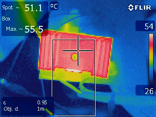
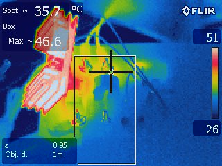

# References

* [current sensing](http://openenergymonitor.org/emon/buildingblocks/ct-sensors-interface)
* [using tiny44/45 with arduino](http://highlowtech.org/?p=1695)

# Todo

* remove tvalues for pcb production
* mitre corners
* bitly link
* silk screen layout
* label all headers
* sort open hardware logo - look at oshpark email for resolution
* add temperature? lm335 (got lots of)
* heatsink mounts?

V3

* button 
* power led from rails

# Testing

55C running a 2kw fan heater

# Code

check [the README](code/README.md)

# Changelog

# v2 

* fix run led - wasn't connected to chip because of naming
* added a temp sensor lm335
* 2 layer board, with ground planes

# v2 todo

* check spi programming works with leds/triacs on pins - yes

# License

This hardware is licensed under the [CERN open hardware license 1.2](http://www.ohwr.org/attachments/2388/cern_ohl_v_1_2.txt), which also included in this repository.
