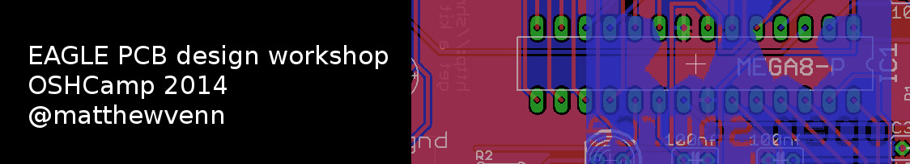
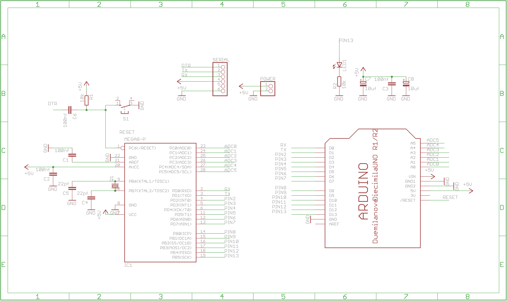
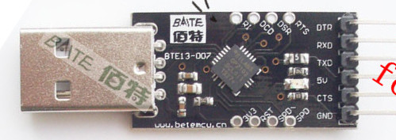

\

# Workshop links

* this document: http://bit.ly/shrimp-links
* shrimp website: http://shrimping.it/blog/shrimp/

# Aim!

* To learn enough Eagle to translate a picture of a schematic (circuit diagram) into a schematic in Eagle.
* To create a board based on the schematic, and do the layout.
* Learn how to create the files required for manufacture.
* Learn how to check the design files.
* Place an order for our PCBS with http://oshpark.com.

# PCB Basics

* Sparkfun's glossary: https://learn.sparkfun.com/tutorials/pcb-basics

# Schematic

We'll be mostly following this guide from sparkfun: https://learn.sparkfun.com/tutorials/using-eagle-schematic

You'll need to install the Adafruit eagle library to get access to the Arduino shield layout:

    * Eagle Version 5: https://github.com/adafruit/Adafruit-Eagle-Library/archive/6042b7efe7b0f2f9511c54ebdba88d8e4de44aa2.zip
    * Eagle Version 6: https://github.com/adafruit/Adafruit-Eagle-Library/archive/master.zip

Here's the schematic direct from the shrimp website: http://shrimping.it/blog/shrimp/shrimpduino_schem/, and I've made a version of this that includes the shield:

Here's how the Arduino's pin numbers map to the real pin numbers of the Arduino chip: http://arduino.cc/en/Hacking/PinMapping168 (though this says it's the 168, it's the same for the 328)

And here's the datasheet of the Arduino chip (ATMega328): http://www.atmel.com/Images/doc8161.pdf

Here's the baite USB to serial TTY module: http://www.aliexpress.com/snapshot/6012255471.html

## Things to watch out for

* Use the net tool (not wire) for linking components.
* Make sure that the TX of the USB module connects to the RX of the Arduino and vica versa for the RX.

# Board

* We'll be mostly following this guide from sparkfun: https://learn.sparkfun.com/tutorials/using-eagle-board-layout
* Use this CAM file from sparkfun: https://dlnmh9ip6v2uc.cloudfront.net/assets/c/1/9/8/2/52056b19757b7f795b2a561c.zip
* Optionally use this DRU file from sparkfun: https://dlnmh9ip6v2uc.cloudfront.net/assets/1/e/3/2/0/52054e25757b7f44119e09da.zip
* Check your board with a web based 3d viewer: http://mayhewlabs.com/webGerber/ 
* Then upload a zip of your gerbers to http://oshpark.com

## Things to watch out for

* OSHPark requires something on all layers (including the bottom silk screen), so put something on there before uploading.

# Ordering PCBs

* Good overview of lots of services by @boldport: http://boldport.blogspot.com.es/2014/02/so-you-want-to-manufacture-your-printed.html

## OSHPark pricing

* £1 per square inch,
* 2 layers,
* free postage to UK,
* minimum order of 3,
* so a set of 3 x 5.6 square inch boards (size of the Arduino) would be £17.25
* https://oshpark.com/pricing

# Parts and building

* http://bit.ly/shrimp-pcb-bom

# Even More links

* Good reference guide from a different workshop: http://psas.pdx.edu/EagleCadWorkshopNotes/#index19h1
* All sparkfun's Eagle tutorials: https://learn.sparkfun.com/tutorials/tags/eagle
* Couple of good instructables on creating schematics and boards:
    * http://www.instructables.com/id/Draw-Electronic-Schematics-with-CadSoft-EAGLE/
    * http://www.instructables.com/id/Turn-your-EAGLE-schematic-into-a-PCB/

# PCB License
* This hardware is licensed under the [CERN open hardware license 1.2](http://www.ohwr.org/attachments/2388/cern_ohl_v_1_2.txt), which also included in this repository.
